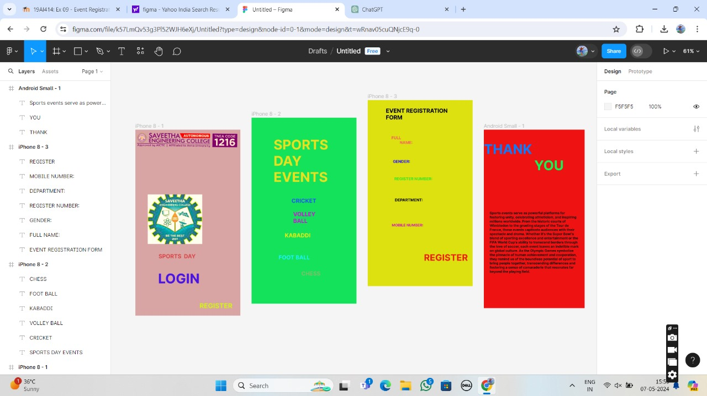

# Ex09 Event Registration Web Application
## Date:07.05.2024

## AIM:
To design, develop and deploy a web application for event registration.

## DESIGN STEPS:

### Step 1:
Create a new frame.

### Step 2:
Select any one preset size of your choice.

### Step 3:
Select the shapes you need.

### Step 4:
Import images as needed.

### Step 5:
Create pages based on your need and link them.

### Step 6:

Validate the HTML and CSS code.

### Step 6:

Publish the website in the given URL.

## DESIGN TOOL:
Figma

## CODE:
```
// home page
<div style="width: 375px; height: 667px; position: relative; background: #D8A5A5">
  
  
  
  <div style="left: 83px; top: 442px; position: absolute; color: #DB4747; font-size: 20px; font-family: Inter; font-weight: 700; word-wrap: break-word">SPORTS  DAY<br/></div>
  <div style="width: 150px; height: 41px; left: 81px; top: 505px; position: absolute; color: #4A14E2; font-size: 48px; font-family: Inter; font-weight: 700; word-wrap: break-word">LOGIN<br/></div>
  <div style="width: 135px; height: 38px; left: 229px; top: 617px; position: absolute"><span style="color: #D4F414; font-size: 24px; font-family: Inter; font-weight: 700; word-wrap: break-word">REGISTER<br/></span><span style="color: black; font-size: 15px; font-family: Inter; font-weight: 700; word-wrap: break-word"><br/></span></div>
</div>

// registration
<div style="width: 375px; height: 667px; position: relative; background: #15E25B">
  <div style="width: 232px; height: 56px; left: 79px; top: 68px; position: absolute; color: #E9E11E; font-size: 48px; font-family: Inter; font-weight: 700; word-wrap: break-word">SPORTS DAY EVENTS<br/></div>
  <div style="width: 123px; height: 40px; left: 143px; top: 286px; position: absolute; color: #1E58EF; font-size: 20px; font-family: Inter; font-weight: 700; word-wrap: break-word">CRICKET</div>
  <div style="width: 91px; height: 31px; left: 149px; top: 334px; position: absolute; color: #CA13D9; font-size: 20px; font-family: Inter; font-weight: 700; word-wrap: break-word">VOLLEY BALL<br/></div>
  <div style="width: 140px; height: 34px; left: 119px; top: 410px; position: absolute; color: #EAEF11; font-size: 20px; font-family: Inter; font-weight: 700; word-wrap: break-word">KABADDI</div>
  <div style="width: 162px; height: 31px; left: 97px; top: 489px; position: absolute; color: #1EF1FF; font-size: 20px; font-family: Inter; font-weight: 700; word-wrap: break-word">FOOT BALL</div>
  <div style="width: 95px; height: 30px; left: 178px; top: 547px; position: absolute; color: #82BE6D; font-size: 20px; font-family: Inter; font-weight: 700; word-wrap: break-word">CHESS<br/></div>
</div>

// events
<div style="width: 375px; height: 667px; position: relative; background: #DDE110">
  <div style="width: 245px; height: 53px; left: 65px; top: 26px; position: absolute; color: black; font-size: 20px; font-family: Inter; font-weight: 700; word-wrap: break-word">EVENT REGISTRATION FORM<br/></div>
  <div style="width: 186px; height: 56px; left: 85px; top: 126px; position: absolute; color: #F55F5F; font-size: 14px; font-family: Inter; font-weight: 700; word-wrap: break-word">FULL<br/>         NAME:</div>
  <div style="width: 159px; height: 49px; left: 90px; top: 211px; position: absolute; color: #220FFC; font-size: 14px; font-family: Inter; font-weight: 700; word-wrap: break-word">GENDER:</div>
  <div style="width: 154px; height: 37px; left: 95px; top: 273px; position: absolute; color: #3CE421; font-size: 14px; font-family: Inter; font-weight: 700; word-wrap: break-word">REGISTER NUMBER:</div>
  <div style="width: 118px; height: 26px; left: 97px; top: 349px; position: absolute; color: black; font-size: 14px; font-family: Inter; font-weight: 700; word-wrap: break-word">DEPARTMENT:<br/></div>
  <div style="width: 118px; height: 31px; left: 86px; top: 440px; position: absolute; color: #D017B2; font-size: 13px; font-family: Inter; font-weight: 700; word-wrap: break-word">MOBILE NUMBER:</div>
  <div style="width: 158px; height: 80px; left: 201px; top: 545px; position: absolute; color: #EC2013; font-size: 32px; font-family: Inter; font-weight: 700; word-wrap: break-word">REGISTER</div>
</div>
// Conclusion
<div style="width: 360px; height: 640px; position: relative; background: #EE1212">
  <div style="width: 203px; height: 100px; left: 0px; top: 41px; position: absolute; color: #0F7BFA; font-size: 48px; font-family: Inter; font-weight: 700; word-wrap: break-word">THANK</div>
  <div style="width: 180px; height: 54px; left: 180px; top: 99px; position: absolute; color: #16F354; font-size: 48px; font-family: Inter; font-weight: 700; word-wrap: break-word">YOU<br/></div>
  <div style="width: 318px; height: 274px; left: 21px; top: 291px; position: absolute; color: #161313; font-size: 12px; font-family: Inter; font-weight: 700; word-wrap: break-word">Sports events serve as powerful platforms for fostering unity, celebrating athleticism, and inspiring millions worldwide. From the historic courts of Wimbledon to the grueling stages of the Tour de France, these events captivate audiences with their spectacle and drama. Whether it's the Super Bowl's blend of sporting excellence and entertainment or the FIFA World Cup's ability to transcend borders through the love of soccer, each event leaves an indelible mark on global culture. As the Olympic Games symbolize the pinnacle of human achievement and cooperation, they remind us of the boundless potential of sport to bring people together, transcending differences and fostering a sense of camaraderie that resonates far beyond the playing field.</div>
</div>

```


## OUTPUT:



## RESULT:
The program to design, develop and deploy a web application for event registration is completed successfully.
